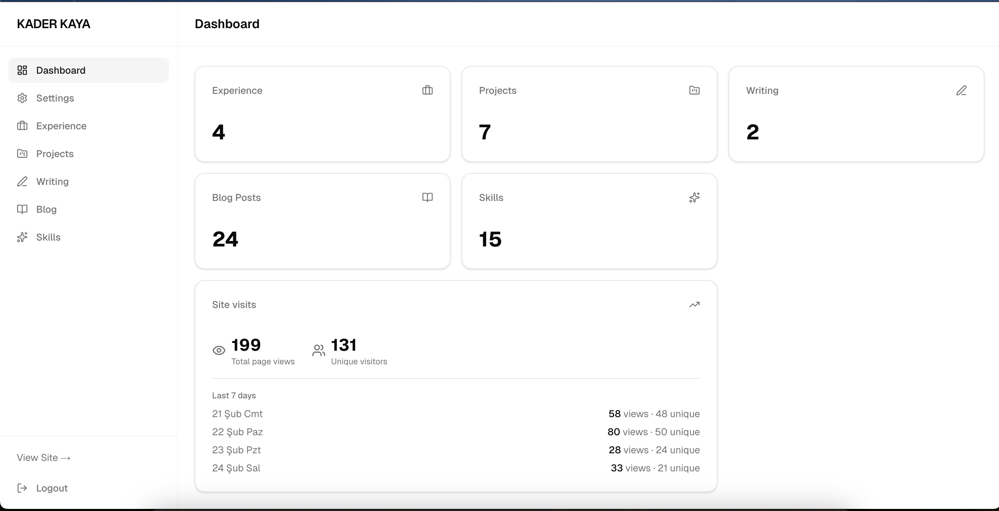
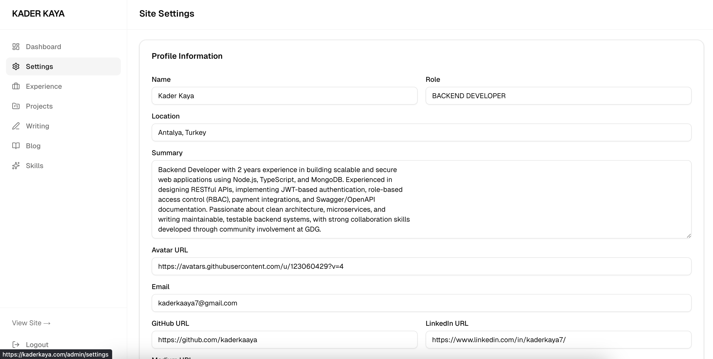
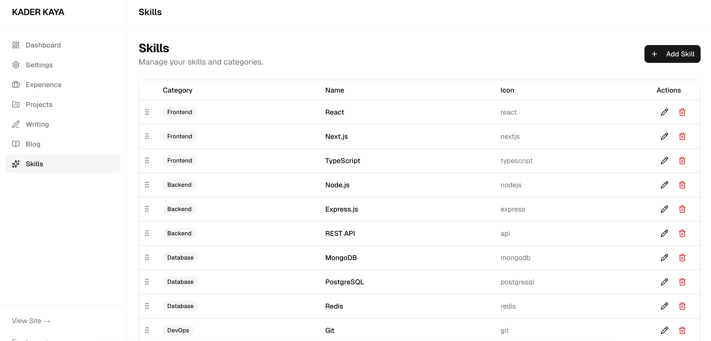
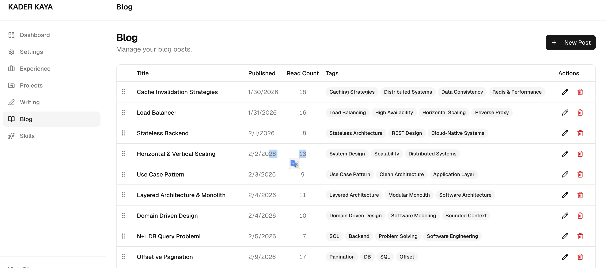
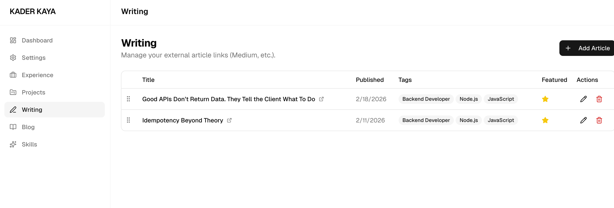
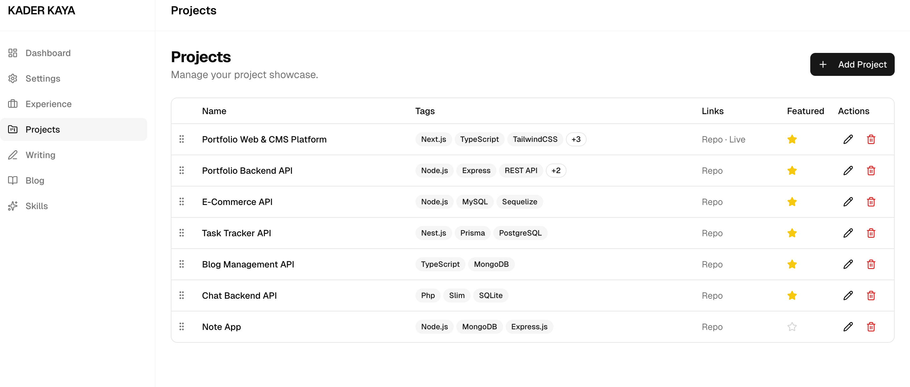
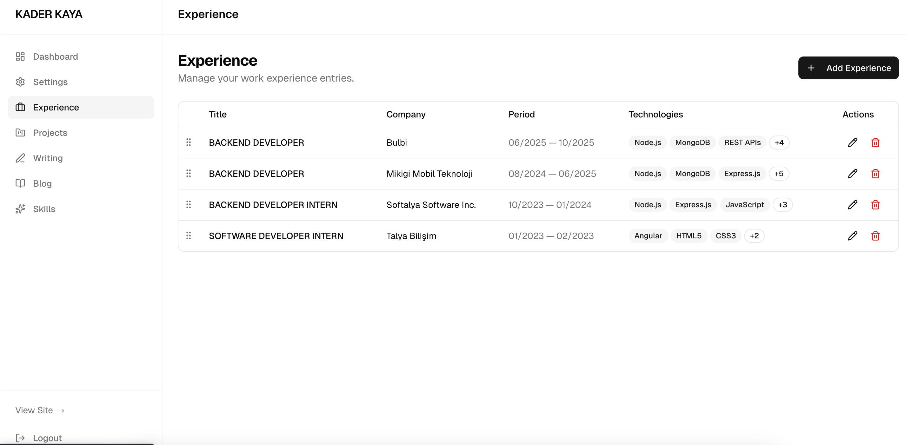

# kaderkaya

Personal portfolio and single-user CMS. Public site is a minimal, CV-style front-end; content is managed via a JWT-protected admin panel. Built with Next.js (App Router) and a repository layer that abstracts the backend API.

## Preview

<p align="center">
  
  
</p>
<p align="center">
  
  
</p>
<p align="center">
  
  
</p>
<p align="center">
  
</p>

## Overview

| Concern | Implementation |
|--------|----------------|
| **Public site** | Server components only. Data is fetched via repository functions; components do not call `fetch` directly. |
| **Admin** | Routes under `/admin` are protected by JWT (httpOnly cookie). Mutations use server actions or route handlers; repositories communicate with the API. |
| **Data layer** | Repository pattern. Phase 1: in-repo mocks. Phase 2: switch to **kaderkaya-api** (Node.js + MongoDB). The UI layer remains unchanged. |
| **Auth** | Single admin identity. Public API is read-only; any write operation requires a valid JWT. Middleware enforces access to `/admin`. |

## Tech stack

- **Runtime:** Node.js 20+
- **Framework:** Next.js 16 (App Router), React 19, TypeScript
- **Styling:** Tailwind CSS 4, shadcn/ui, Radix UI
- **Validation & UX:** Joi, Sonner, react-markdown
- **Tooling:** ESLint, Prettier

## Prerequisites

- Node.js 20 or later
- (Phase 2) Running instance of **kaderkaya-api** for live data

## Getting started

```bash
npm install
npm run dev
```

Configure the API base URL in `.env`:

```env
NEXT_PUBLIC_API_URL=http://localhost:3001
```

If `NEXT_PUBLIC_API_URL` is not set, the app uses mock data and does not require the backend.

| URL | Description |
|-----|-------------|
| [http://localhost:3000](http://localhost:3000) | Public portfolio |
| [http://localhost:3000/admin](http://localhost:3000/admin) | Admin CMS (login required) |

## Scripts

| Command | Description |
|---------|-------------|
| `npm run dev` | Start development server |
| `npm run build` | Create production build |
| `npm run start` | Start production server |
| `npm run lint` | Run ESLint |

## Project structure

```
src/
├── app/
│   ├── (public)/     # Public routes (home, blog, writing, skills, experience, contact)
│   └── admin/        # Admin dashboard and login
├── components/       # Shared UI and admin tables
├── lib/              # API client, auth, site config, utilities
├── repositories/     # Data access layer (typed, backend-agnostic)
└── types/            # Shared TypeScript types
```

## Deployment

| Environment | Platform |
|-------------|----------|
| Frontend | Vercel |
| Backend API | **kaderkaya-api** (self-hosted Node.js server) |
